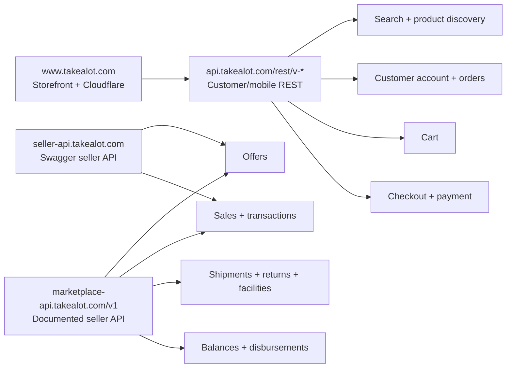

# Takealot API Research

Captured on 27 August 2026.

This is an external API-surface map, not a map of Takealot's internal
microservices. The documented seller API and the customer/mobile API are
separate surfaces. The customer/mobile surface is useful for catalogue
research and explicit wishlist actions, but it is not presented by Takealot as
a supported public developer API.

## High-level map



The normal website was protected by a Cloudflare security challenge during
browser inspection, so its complete current browser network graph could not be
verified directly. Android route and payload details were statically inspected
from the installed Takealot 4.2.1 APK. The CLI preserves the mobile cookie jar
for login/OTP and stores the resulting session only in the native OS keyring.

## API surfaces

| Surface | Base URL | Authentication | Confidence / use |
|---|---|---|---|
| Storefront | `https://www.takealot.com` | Browser/session + Cloudflare | Public UI; not fully inspected in this pass |
| Current seller API | `https://marketplace-api.takealot.com/v1` | `X-API-Key` | Official, documented integration surface |
| Parallel seller API | `https://seller-api.takealot.com` | Swagger describes an `Authorization` header containing the seller API key | Official Swagger surface; separate contract |
| Customer/mobile API | `https://api.takealot.com/rest/v-1-16-0` | Mobile bearer token/cookies for customer-specific operations | Observed/undocumented; expect changes |

## Current documented seller API

Official documentation: <https://marketplace-api.takealot.com/v1/docs>

```text
GET    /docs
GET    /status

GET    /offers
POST   /offers
GET    /offers/{offer_id}
PATCH  /offers/{offer_id}
GET    /offers/by_sku/{sku}
PATCH  /offers/by_sku/{sku}
GET    /offers/by_barcode/{barcode}
PATCH  /offers/by_barcode/{barcode}
POST   /offers/batch
GET    /offers/batch/{batch_id}

GET    /sales
GET    /transactions
GET    /balances
GET    /shipments
GET    /shipments/{shipment_id}
GET    /returns
GET    /returns/{return_id}
GET    /facilities/get_enabled_regions
GET    /seller
```

Seller API behavior:

- Seller-specific endpoints require `X-API-Key`.
- The key is associated with one seller account. The documentation says only
  one key can be active per account and that there are no endpoint-level
  scopes.
- Collection responses normally contain `items` and `limit`, with optional
  `count` and `continuation_token` fields.
- `fields` limits returned fields; `expands` includes related resources.
- Arrays are represented as repeated query parameters, for example
  `fields=offer_id&fields=sku`.
- Continuation-token requests ignore other query parameters and do not return a
  count.
- Offer batches accept up to 10,000 offers in the documented request schema.

Example read request:

```bash
curl "https://marketplace-api.takealot.com/v1/offers?limit=100&fields=offer_id&fields=sku" \
  -H "X-API-Key: $TAKEALOT_API_KEY"
```

## Parallel Swagger seller API

- Swagger UI: <https://seller-api.takealot.com/api-docs/>
- Swagger JSON: <https://seller-api.takealot.com/api-docs/swagger.json>

```text
GET    /v2/offers
GET    /v2/offers/count
GET    /v2/offers/offer/{identifier}
POST   /v2/offers/offer/{identifier}
PATCH  /v2/offers/offer/{identifier}
GET    /v2/offers/offer?identifier=...
POST   /v2/offers/offer?identifier=...
PATCH  /v2/offers/offer?identifier=...
POST   /v2/offers/batch
GET    /v2/offers/batch/{batch_id}

GET    /{version}/offers/stock_counts
GET    /{version}/offers/stock_health_stats
GET    /{version}/sales
GET    /{version}/sales/summary
GET    /{version}/sales/orders
GET    /{version}/sales/orders/{order_id}/customer_invoices
```

## Customer/mobile API

Observed base:

```text
https://api.takealot.com/rest/v-1-16-0
```

Public third-party route reference used for comparison:
<https://github.com/yashiels/takealot-cli/blob/main/docs/MOBILE-API.md>

This is not an official Takealot developer contract. The route families below
are useful for research, but production code should prefer an authorized,
documented integration.

### Authenticated route families observed

```text
POST /customers/login
POST /customers/auth/refresh

GET  /customers/{customer_id}/summary
GET  /customer/{customer_id}/orders
GET  /customers/{customer_id}/wishlists/summary

GET  /customers/{customer_id}/wishlists
POST /customers/{customer_id}/wishlists
PUT  /customers/{customer_id}/wishlists/{group_id}
DELETE /customers/{customer_id}/wishlists/{group_id}
GET  /customers/{customer_id}/wishlists/{group_id}/items
PUT  /customers/{customer_id}/wishlists/items/pid/{product_id}
DELETE /customers/{customer_id}/wishlists/items/pid/{product_id}
GET  /customers/{customer_id}/credits/balance

GET  /customers/{customer_id}/cart
POST /customers/{customer_id}/cart/items

GET/POST /checkout/...
GET/POST /order/...
```

The CLI implements login, token refresh, and wishlist routes from the Android
client. Cart mutation, checkout, payment, orders, and other customer actions
remain out of scope. Wishlist writes are only sent after an explicit user
confirmation and the CLI's `--confirm` flag.

### Android login flow

The installed app uses the Android-shaped request below against
`v-1-16-0`:

```json
{
  "platform": "android",
  "sections": [{
    "section_id": "customer_login",
    "fields": [
      {"field_id": "email", "value": "..."},
      {"field_id": "password", "value": "..."},
      {"field_id": "captcha", "value": ""}
    ]
  }]
}
```

When the response contains `two_step_verification`, the second request keeps
the first response's `__cf_bm` cookie and adds:

```json
{"section_id":"two_step_verification","fields":[
  {"field_id":"otp","value":"..."},
  {"field_id":"trust_this_device","value":true}
]}
```

Successful `auth_info` contains `jwt`, `id_token`, `refresh_token`,
`csrf_token`, `tracking_id`, `customer_id`, and device-related fields. Refresh
rotates the refresh token, so the CLI replaces the keyring session atomically
after a successful refresh. No real credentials or captured tokens belong in
this repository.

### Android wishlist payloads

The installed app's request models show these payloads:

```text
POST /customers/{customer_id}/wishlists
{"name":"My list"}

PUT /customers/{customer_id}/wishlists/items/pid/{product_id}
{"reset":false,"groups":[{group_id}]}

PUT /customers/{customer_id}/wishlists/{group_id}
{"name":"Renamed list"}
```

The CLI resolves a PLID through product details to obtain `product_id` before
using the `pid` wishlist route. It never treats a TSIN or product ID supplied
as a bare detail-command reference as a PLID.

### Public/read-only catalogue route families observed

```text
GET /search/autocomplete
GET /searches/...
GET /search/trending
GET /product-details/PLID{plid}
GET /product-card/PLID{plid}
GET /product-reviews/plid/{plid}
```

## Read-only exploration results

### Search request shape

Search used the desktop-style route on API version `v-1-14-0`:

```text
GET /searches/products,filters,facets,sort_options,breadcrumbs,
    slots_audience,context,seo,layout
```

Observed query parameters:

```text
r=1
sb=1
si=63b04484becf69dd89948104f99effc7
qsearch={query}
searchbox=true
```

Response top-level keys:

```text
sections
section_keys
search_request
attribution_token
```

Product results are under `sections.products.results[]`. Each result observed
had a `product_views` object containing:

```text
core
gallery
promotions_summary
variant_summary
review_summary
buybox_summary
stock_availability_summary
selectors
```

Important identifiers:

- `core.id` is the product-line ID used as `PLID{core.id}` for product details.
- `buybox_summary.product_id` is the product/SKU identifier used by the cart
  layer.
- `buybox_summary.tsin` is the TSIN identifier.

### Search samples

The search endpoint returned 36 results for each query in this sample. Counts
are the rating-distribution values returned by the API.

| Query | Product | PLID | Product ID | Price | Rating | Reviews | 1★ | 2★ | 3★ | 4★ | 5★ |
|---|---|---:|---:|---:|---:|---:|---:|---:|---:|---:|---:|
| wireless earbuds | Volkano Scorpio True Wireless Earphones | 66383997 | 90401948 | R 299 | 4.7 | 3,044 | 47 | 7 | 2 | 686 | 2,302 |
| wireless earbuds | Wireless Earbuds Bluetooth Headphones - Black | 97509918 | 221687901 | R 215 | 4.2 | 59 | 5 | 3 | 7 | 7 | 37 |
| wireless earbuds | Volkano Jupiter True Wireless Earphones | 95283397 | 215745169 | R 249 | 4.6 | 866 | 23 | 14 | 20 | 173 | 636 |
| wireless earbuds | Skullcandy Ink'd True Wireless Earbuds | 101161386 | 230881731 | R 369 | 4.8 | 58 | 0 | 0 | 1 | 8 | 49 |
| wireless earbuds | soundcore R50i True Wireless Earbuds | 93815195 | 209385972 | From R 299 | 4.6 | 1,674 | 35 | 26 | 55 | 282 | 1,276 |
| coffee maker | Defy DCM630G Filter Coffee Machine | 96304207 | 219170546 | R 399 | 4.5 | 35 | 0 | 1 | 4 | 5 | 25 |
| coffee maker | Kenwood 10-cup Drip Coffee Maker | 91809609 | 204104984 | R 699 | 4.3 | 150 | 13 | 6 | 6 | 28 | 97 |
| coffee maker | Fully Automatic Espresso/Mocha Machine | 97266156 | 236285658 | R 1,309 | 4.3 | 34 | 3 | 1 | 4 | 2 | 24 |
| coffee maker | HOMTTO Espresso Machine, 20 Bar, 1.8L | 98450245 | 224878238 | R 1,499 | 4.5 | 64 | 1 | 1 | 2 | 20 | 40 |
| coffee maker | Drip Coffee Machine, 750ML, Black | 98255135 | 223684618 | R 454 | 3.0 | 4 | 0 | 2 | 1 | 0 | 1 |
| laptop stand | Adjustable/Folding Laptop Stand - Grey | 73895683 | 215644141 | From R 99 | 4.6 | 1,137 | 15 | 22 | 51 | 235 | 814 |
| laptop stand | Portable Laptop Stand, 10-15.6 inch, Silver | 60868518 | 215644123 | From R 90 | 4.6 | 1,151 | 22 | 19 | 45 | 238 | 827 |
| laptop stand | Laptop Cooling Pad with Adjustable Height | 97222204 | 233671553 | R 177 | 4.9 | 18 | 0 | 0 | 1 | 0 | 17 |
| laptop stand | Adjustable Height/Angle 360 Rotation Stand | 95525439 | 239183103 | From R 168 | 4.2 | 135 | 15 | 2 | 7 | 27 | 84 |
| laptop stand | 10-Level Ergonomic Laptop/Tablet/Phone Stand | 96905579 | 220471384 | From R 138 | 4.0 | 118 | 8 | 6 | 24 | 22 | 58 |

The five rating buckets add up to the reported review count for each sampled
product.

## Product details

Request shape:

```text
GET /product-details/PLID{plid}?platform=android&show_takealot_now_alt=false&offer_opt=true
```

Example:

```text
GET https://api.takealot.com/rest/v-1-16-0/product-details/PLID66383997?platform=android&show_takealot_now_alt=false&offer_opt=true
```

Observed top-level fields:

```text
title, desktop_href, core, badges, buybox, breadcrumbs, gallery,
product_information, description, bullet_point_attributes, reviews, meta,
variants, exchanges_and_returns, pdp_ad_slots, sharing, event_data,
enhanced_ecommerce_detail, enhanced_ecommerce_add_to_cart
```

| Product | PLID | Gallery images | Reviews | Rating | Selected detail fields |
|---|---:|---:|---:|---:|---|
| Volkano Scorpio Earphones | 66383997 | 15 | 3,044 | 4.7 | brand, warranty, wireless, waterproof, rechargeable, connectivity, noise control |
| Defy DCM630G Coffee Machine | 96304207 | 5 | 35 | 4.5 | brand, power, warranty, water usage, model, cups, machine type, colour, barcode |
| Adjustable Laptop Stand - Grey | 73895683 | 16 | 1,137 | 4.6 | warranty, materials, model, adjustability, stand features, recommended uses |

The detail response's `reviews` object contains the review-feed URL, total
count, average rating, and rating distribution.

## Reviews

### Review-feed endpoint

```text
GET /product-reviews/plid/{plid}
```

Example:

```text
GET https://api.takealot.com/rest/v-1-16-0/product-reviews/plid/66383997
```

Response keys:

```text
reviews[]
page_info
sort_options
filters
```

Observed `page_info`:

```json
{
  "total": 3044,
  "total_pages": 305,
  "current_page": 0,
  "page_size": 10
}
```

Observed review fields:

```text
tsin_id
customer_id
signature
rating
uuid
text.body
num_upvotes
customer_name
date
time_after_purchase       // present on some reviews
variant_info
```

Customer identifiers, signatures, and reviewer names are intentionally omitted
from this note because they are not needed to understand the API shape.

### Review query parameters confirmed

| Purpose | Query |
|---|---|
| First page / default | no query string; observed default is page 0 with 10 reviews |
| Page | `page=0`, `page=1`, etc.; observed pages are zero-based |
| Rating filter | `rating=5`, `rating=4`, ..., `rating=1` |
| Sort by latest | `sort=SO_LATEST` |
| Sort by most helpful | default; response advertises `SO_MOST_HELPFUL` |
| Variant filter | `colour_variant=Black`, `colour_variant=White`, etc. |
| Combined filters | for example `rating=5&colour_variant=Black` |

For PLID 66383997:

| Request | Result |
|---|---|
| `/product-reviews/plid/66383997` | 3,044 total; 305 pages; default sort most helpful |
| `...?rating=5` | 2,302 five-star reviews; 231 pages |
| `...?rating=1` | 47 one-star reviews; 5 pages |
| `...?sort=SO_LATEST&page=0` | 3,044 total; newest observed review dated 26 Aug 2026 |
| `...?colour_variant=Black` | 2,346 reviews for Black |
| `...?rating=5&colour_variant=Black` | 1,766 five-star Black-variant reviews |

The response advertises `SO_MOST_HELPFUL` and `SO_LATEST` sort values, plus
rating values 5 through 1. Products with variants expose a product-dependent
variant filter.

### Review observations

| Product | Query | Observed behavior |
|---|---|---|
| Volkano Scorpio | `rating=5` | Five-star results only; samples mention sound quality, bass, and battery life |
| Volkano Scorpio | `rating=1` | One-star results only; samples mention faulty/intermittent earbuds and buzzing |
| Volkano Scorpio | `sort=SO_LATEST&page=0` | Mixed ratings; newest sampled page included both one- and five-star reviews |
| Defy DCM630G | `rating=5` | 25 five-star reviews |
| Defy DCM630G | `rating=1` | 0 one-star reviews |
| Adjustable Laptop Stand | `rating=5` | 814 five-star reviews |
| Adjustable Laptop Stand | `rating=1` | 15 one-star reviews |

## Implementation notes

1. The Go CLI preserves `PLID`, `product_id`, and `tsin` as separate
   identifiers and uses the native OS keyring for the mobile session.
2. The browser login page is bound to loopback only; credentials are posted to
   the CLI, never exposed as command arguments or chat output.
3. Review filters remain dynamic and review pages are zero-based.
4. Reviewer names, customer IDs, and signatures are excluded from normalized
   output.
5. Cart changes, checkout, payment, orders, and other customer actions remain
   out of scope.

## Sources

- Official Marketplace API documentation: <https://marketplace-api.takealot.com/v1/docs>
- Official Marketplace API status: <https://marketplace-api.takealot.com/v1/status>
- Official Seller API Swagger UI: <https://seller-api.takealot.com/api-docs/>
- Official Seller API Swagger JSON: <https://seller-api.takealot.com/api-docs/swagger.json>
- Third-party mobile API route reference: <https://github.com/yashiels/takealot-cli/blob/main/docs/MOBILE-API.md>
